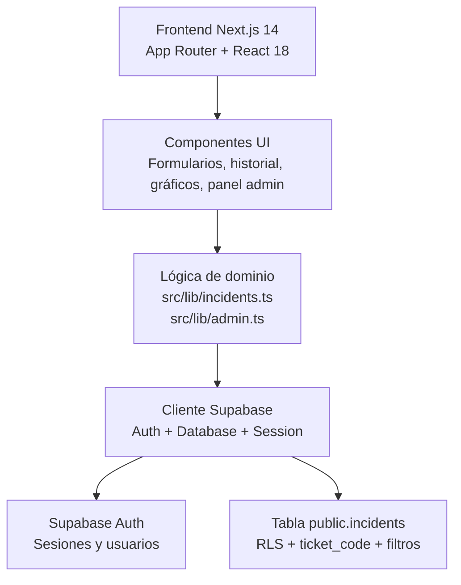

# Historial de Incidencias TI

Aplicación web para registrar, consultar y analizar incidencias técnicas resueltas.

Está construida con `Next.js 14`, `React 18`, `TypeScript` y `Supabase`, con foco en operación interna, trazabilidad y una experiencia clara para técnicos y administración.

## Qué incluye hoy

- Autenticación con `Supabase Auth`
- Registro de incidencias con `ticket_code` automático
- Historial para usuarios con búsqueda, filtros, orden y paginación
- Panel admin con KPIs, gráficos y vista global
- Restricción por usuario mediante `RLS`
- Acceso admin configurable mediante `NEXT_PUBLIC_PRIMARY_ADMIN_EMAIL`

## Stack

- `Next.js 14` con App Router
- `React 18`
- `TypeScript`
- `Supabase`
- `Recharts`
- `react-datepicker`
- `date-fns`

## Estructura del proyecto

```txt
src/
  app/
    admin/
    dashboard.tsx
    globals.css
    layout.tsx
    page.tsx
  components/
    admin-*.tsx
    auth.tsx
    dashboard-side-panel.tsx
    incident-*.tsx
    incidents-chart.tsx
    live-clock.tsx
    logo.tsx
  lib/
    admin.ts
    incidents.ts
    supabase-client.ts
    types.ts

scripts/
  schema.sql

TESTING.md
AGENTS.md
```

## Arquitectura



### Capas principales

| Capa | Responsabilidad | Archivos clave |
|---|---|---|
| Presentación | Renderiza vistas, formularios, tablas, gráficos y panel admin | `src/app`, `src/components` |
| Dominio | Centraliza consultas, creación de incidencias, filtros y control admin | `src/lib/incidents.ts`, `src/lib/admin.ts` |
| Infraestructura | Maneja cliente Supabase, sesión y acceso a datos | `src/lib/supabase-client.ts` |
| Persistencia | Guarda incidencias, usuarios autenticados y reglas RLS | `Supabase`, `scripts/schema.sql` |

### Vista rápida por módulos

```txt
+---------------------------+
| Dashboard de usuario      |
| - Formulario              |
| - Historial               |
| - Gráfico y reloj         |
+---------------------------+
            |
            v
+---------------------------+
| Lógica compartida         |
| - incidents.ts            |
| - admin.ts                |
| - types.ts                |
+---------------------------+
            |
            v
+---------------------------+
| Supabase Client           |
| - auth                    |
| - session                 |
| - queries                 |
+---------------------------+
            |
            v
+---------------------------+
| Supabase                  |
| - auth.users              |
| - public.incidents        |
| - RLS policies            |
+---------------------------+
```

## Requisitos

- `Node.js 18+`
- Un proyecto de `Supabase`
- Variables públicas de entorno para Supabase

## Variables de entorno

Crea un archivo `.env.local`:

```env
NEXT_PUBLIC_SUPABASE_URL=https://tu-proyecto.supabase.co
NEXT_PUBLIC_SUPABASE_ANON_KEY=tu-anon-key
NEXT_PUBLIC_PRIMARY_ADMIN_EMAIL=admin@tu-dominio.com
```

## Instalación

```bash
npm install
```

## Desarrollo local

```bash
npm run dev
```

Si el entorno local queda en un estado extraño, puedes limpiar `.next` y volver a levantar:

```bash
npm run dev:clean
```

## Scripts disponibles

```bash
npm run dev
npm run dev:clean
npm run build
npm start
npm run type-check
npm run lint
```

Notas:

- `npm run lint` puede abrir el asistente interactivo de configuración de Next/ESLint si el entorno no está totalmente inicializado.
- `npm run setup-db` existe en `package.json`, pero actualmente depende de `scripts/setup-db.js`, que no está presente.
- No hay un runner de tests automáticos configurado todavía.

## Base de datos

El SQL fuente de verdad está en:

[`scripts/schema.sql`](./scripts/schema.sql)

Ese archivo contiene:

- Tabla `public.incidents`
- Índices
- Políticas `RLS`
- Soporte para `ticket_code`
- Referencia para la policy admin por email

## Ticket automático

Cada incidencia recibe un código de ticket automático al crearse. Ejemplo:

```txt
TKT-20260313-104530-AB12
```

Ese código puede usarse para buscar incidencias rápidamente tanto en el historial normal como en el panel admin.

## Seguridad

### RLS

La tabla `incidents` está pensada para que:

- Cada usuario vea solo sus propios registros
- Cada usuario cree, edite o elimine solo sus propios registros
- El admin autorizado pueda consultar el panorama global

### Admin

El frontend y la policy recomendada están alineados para permitir acceso admin exclusivamente a:

```txt
NEXT_PUBLIC_PRIMARY_ADMIN_EMAIL
```

Importante: el valor de `NEXT_PUBLIC_PRIMARY_ADMIN_EMAIL` debe coincidir con el email permitido en la policy SQL de [`scripts/schema.sql`](./scripts/schema.sql).

## Estado funcional actual

Actualmente el sistema incluye:

- Dashboard principal con formulario de registro
- Gráfico de incidencias por día
- Reloj y panel lateral de resumen
- Historial paginado con detalle de incidencias
- Panel admin con filtros, KPIs y gráficos

Actualmente no incluye:

- Suite automática de tests
- API routes personalizadas
- Script funcional de bootstrap de base de datos con `npm run setup-db`

## Testing manual

La referencia oficial de pruebas manuales está en:

[`TESTING.md`](./TESTING.md)

Flujo recomendado:

1. Ejecutar `npm run dev`
2. Abrir `http://localhost:3000`
3. Seguir uno o más escenarios de [`TESTING.md`](./TESTING.md)
4. Revisar comportamiento visual, consola y errores de red

## Deploy en Vercel

### 1. Validación local

```bash
npm run type-check
npm run build
```

### 2. Variables de entorno en Vercel

Debes configurar:

- `NEXT_PUBLIC_SUPABASE_URL`
- `NEXT_PUBLIC_SUPABASE_ANON_KEY`
- `NEXT_PUBLIC_PRIMARY_ADMIN_EMAIL`

### 3. Despliegue

Importa el repositorio en Vercel y realiza el deploy normalmente.

## Recomendaciones antes de probar en entorno

- Limpiar incidencias y usuarios de prueba en Supabase
- Dejar solo la cuenta admin real
- Verificar la policy admin por email
- Probar login, creación, búsqueda, edición, eliminación y acceso admin

## Solución de problemas

### La app queda en "Cargando..." después de limpiar usuarios

Si eliminaste usuarios directamente en Supabase, el navegador puede conservar una sesión local inválida.

Prueba esto:

1. Cerrar sesión si la interfaz lo permite
2. Hacer recarga dura con `Ctrl + F5`
3. Limpiar los datos del sitio para `localhost:3000`
4. Volver a iniciar sesión

### No aparece el admin

Verifica que:

- El correo autenticado coincida con `NEXT_PUBLIC_PRIMARY_ADMIN_EMAIL`
- La metadata o policy SQL estén alineadas con ese correo
- La sesión actual sea reciente y válida

## Roadmap sugerido

- Terminar de corregir textos con acentos dañados en toda la UI
- Incorporar pruebas automáticas básicas
- Documentar migraciones SQL con más detalle
- Reducir consultas duplicadas del dashboard principal

## Licencia

Uso interno. Ajustar según la política del proyecto o la institución.
