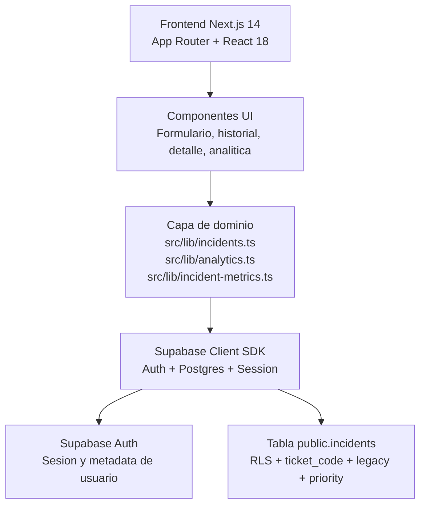

# Historial de Incidencias TI: Operacion, Trazabilidad y Analitica Didactica

<div align="center">


<br />


</div>

---

## Vision General

**Historial de Incidencias TI** es una plataforma interna para registrar, consultar y analizar atenciones tecnicas con foco operativo.  
El sistema permite crear tickets con nomenclatura corta (`TK-0001`), mantener trazabilidad de tickets historicos (`legacy_ticket_code`), gestionar incidencias por usuario con RLS y visualizar analitica didactica para toma de decisiones.

---

## Funcionalidades Clave

- Registro de incidencias con ticket automatico y prioridad (`LOW`, `MEDIUM`, `HIGH`, `CRITICAL`)
- Formulario con categorias definidas, validaciones por campo, atajos de teclado y deteccion de posibles duplicados
- Historial con busqueda priorizada, filtros rapidos (`Hoy`, `Ultimos 7 dias`, `Mi carga`), paginacion y exportacion CSV
- Modal de detalle con edicion segura, SLA informativo y timeline de hitos del ticket
- Dashboard de analitica con comparativas de periodo, tendencias, heatmap, distribucion por prioridad y hallazgos didacticos
- Layout rebrandeado (sidebar + topbar) con accesos rapidos operativos (Gestion Usuarios, IMC, Aranda)

---

## Arquitectura (App + Datos)



### Capas principales

| Capa | Responsabilidad | Archivos clave |
|---|---|---|
| Presentacion | Vistas, formularios, tablas, modales y graficos | `src/app`, `src/components` |
| Dominio | CRUD de incidencias, filtros, ranking, KPIs, SLA y exportacion | `src/lib/incidents.ts`, `src/lib/analytics.ts`, `src/lib/incident-metrics.ts` |
| Infraestructura | Sesion, auth y cliente Supabase | `src/lib/supabase-client.ts` |
| Persistencia | Datos de incidencias y politicas RLS | `scripts/schema.sql`, Supabase |

---

## Stack Tecnologico

### Frontend
- Next.js 14 (App Router)
- React 18
- TypeScript (strict mode)
- Recharts
- react-datepicker + date-fns

### Datos y Auth
- Supabase Auth
- Supabase Postgres
- Politicas RLS por `user_id` + regla admin por email

### UI/UX
- Sistema visual global en `globals.css`
- Rebranding light sobrio (Zendesk/Freshservice-inspired)
- Animaciones suaves globales con soporte `prefers-reduced-motion`

---

## Estructura del Repositorio

```text
src/
  app/
    admin/
    analitica/
    auth/callback/
    historial/
    reset-password/
    signup-confirmed/
    dashboard.tsx
    globals.css
    layout.tsx
    page.tsx
  components/
    app-shell.tsx
    incident-form.tsx
    incident-list.tsx
    incident-detail.tsx
    admin-*.tsx
    incidents-*.tsx
    logo.tsx
  lib/
    incidents.ts
    analytics.ts
    incident-metrics.ts
    incident-config.ts
    types.ts
    supabase-client.ts
scripts/
  schema.sql
TESTING.md
AGENTS.md
```

---

## Instalacion y Ejecucion

### Requisitos
- Node.js 18+
- Proyecto Supabase activo
- Variables de entorno publicas configuradas

### Variables de entorno

Crear `.env.local`:

```env
NEXT_PUBLIC_SUPABASE_URL=https://tu-proyecto.supabase.co
NEXT_PUBLIC_SUPABASE_ANON_KEY=tu-anon-key
NEXT_PUBLIC_PRIMARY_ADMIN_EMAIL=admin@tu-dominio.com
```

### Comandos principales

```bash
npm install
npm run dev
npm run build
npm start
npm run type-check
npm run lint
```

---

## Base de Datos y SQL

El SQL fuente de verdad esta en:

[`scripts/schema.sql`](./scripts/schema.sql)

Incluye:
- Tabla `public.incidents`
- Trigger para `ticket_code` automatico (`TK-0001`)
- `legacy_ticket_code` para trazabilidad historica
- Campo `priority` con default `MEDIUM`
- Indices (incluyendo `priority + attention_datetime`)
- Politicas RLS de lectura/escritura por propietario y admin

---

## Testing y Validacion Manual

No hay suite automatica de tests configurada actualmente.  
La referencia oficial de validacion manual esta en:

[`TESTING.md`](./TESTING.md)

Flujo recomendado:
1. Levantar app con `npm run dev`
2. Ejecutar escenarios de auth, dashboard, historial y admin
3. Validar responsive, foco visible, estados de error/disabled y filtros
4. Verificar que no haya regresiones de permisos ni de datos

---

## Deploy (Vercel)

1. Validar local:

```bash
npm run type-check
npm run build
```

2. Configurar variables en Vercel:
- `NEXT_PUBLIC_SUPABASE_URL`
- `NEXT_PUBLIC_SUPABASE_ANON_KEY`
- `NEXT_PUBLIC_PRIMARY_ADMIN_EMAIL`

3. Importar repositorio y desplegar normalmente.

---

## Roadmap

- Completar exportaciones adicionales (XLSX/PDF)
- Anadir deteccion de anomalias por categoria/prioridad
- Incorporar trazabilidad persistente por eventos (`incident_events`) en fase posterior
- Agregar suite automatica de pruebas (unitarias + flujos criticos)

---

## Autor / Equipo

Proyecto interno orientado a operacion TI institucional.

---

## Licencia

Uso interno. Ajustar segun politica de la organizacion.
